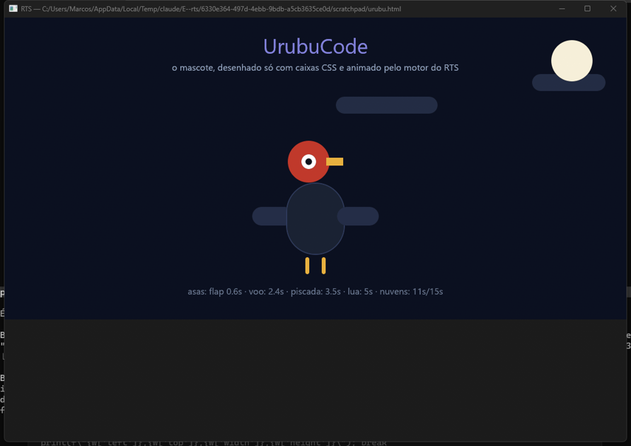

<div align="center">


# `rts_`

### **TypeScript compiled to a native binary. No runtime. No heavy GC. No excuses.**

*A vulture in sunglasses is never in a hurry — it has already arrived.*

[](https://cranelift.dev)
[](https://www.rust-lang.org)
[](LICENSE)
[](#)
<!-- CROSS_RUNTIME_BADGE_START -->
[](docs/specs/cross-runtime-testing.md)
<!-- CROSS_RUNTIME_BADGE_END -->

</div>

<!-- CROSS_RUNTIME_STATS_START -->
## 🌐 Cross-runtime parity

JS spec compatibility validated against **Bun** and **Node** over 679 standalone TS fixtures.

```
[▰▰▰▰▰▰▰▰▰▰▰▰▰▰▰▱▱▱▱▱] 72.9%   481/660 fixtures passing
```

| Metric | Value |
|---|---|
| **Parity** | **72.9%** (481/660) |
| ✅ RTS = Bun = Node | 481 |
| ❌ RTS diverges | 93 |
| 💥 RTS runtime error | 86 |
| 🛠️  **Left to fix** | **179** |
| ⚠️ Bun ≠ Node (skip) | 19 |
| 🚫 Rejected (RTS-only) | 0 |
| 📦 Total fixtures | 679 |

_Updated: 2026-07-24 — [how to add a fixture](docs/specs/cross-runtime-testing.md)_

<!-- CROSS_RUNTIME_STATS_END -->

---

## 🦅 What it is

**RTS** is a compiler + runtime that takes your `.ts` and spits out a native `.exe`.
It is not a transpiler, not a bundler, not a wrapper around V8 — it is Cranelift
generating machine code directly from the SWC AST, with a minimal Rust runtime
and a typed, boxing-free ABI.

Two paths, same codegen:

| Mode | Command | What it does |
|------|---------|-----------|
| 🚀 **JIT** | `rts run app.ts` | Compiles to executable memory and runs. Zero disk. |
| 📦 **AOT** | `rts compile -p app.ts out` | Object file → linker → standalone binary (~3 KB). |

---

## ⚡ Performance — honest numbers, new engine

> **Context.** The engine was rewritten from scratch on a sound value model
> (`PolyValue` NaN-box + shapes + inline caches) and the campaign so far has
> been **correctness-first** (parity badge above). The deleted old engine's
> peak (Monte Carlo AOT **16.9 ms**, 5.4× faster than Bun; HTTP 29k req/s)
> is the documented performance **target to re-clear**, not the current
> state. Numbers below are **end-to-end process time** (startup included —
> AOT runtime init is ~70 ms of every figure) measured now on the new engine.

<!-- BENCH_STATS_START -->
### 📊 Measured benchmarks (auto-updated by CI)

End-to-end process time (includes startup/JIT compile), median of 20 runs after 3 warmups, GitHub Actions `windows-latest` — commit `270aa72`.

| Bench | Bun | Node | Deno | RTS JIT | **RTS AOT** | AOT vs Bun | AOT vs Node |
|---|---|---|---|---|---|---:|---:|
| Monte Carlo π 10M (same xorshift algorithm) | 4.81 s | 7.42 s | 3.61 s | 221 ms | **124 ms** | **38.96×** | **60.10×** |
| Monte Carlo π 10M (JS `Math.random`) | 117 ms | 259 ms | 215 ms | 214 ms | **121 ms** | **0.96×** | **2.13×** |
| π decimal ~30 digits (i128 vs BigInt) | 50 ms | 54 ms | 41 ms | 123 ms | **31 ms** | **1.62×** | **1.76×** |
| Monte Carlo 10M threaded (vs Bun Workers) | 161 ms | — | — | 192 ms | **104 ms** | **1.55×** | — |
| π Machin f64 (RTS only) | — | — | — | 118 ms | **31 ms** | — | — |

_Updated: 2026-07-23 — run locally with `powershell -File bench/benchmark.ps1`_

<!-- BENCH_STATS_END -->

**Why native wins (and where the work is).** RTS compiles TS to machine
code via Cranelift — no JIT warmup, no interpreter tier, native 64-bit
integer arithmetic JS engines can't touch without BigInt. The `PolyValue`
NaN-box only pays where code is actually polymorphic and the Cranelift
egraph folds redundant box/unbox away — the design that made the old
engine 5× faster than Bun is intact; wiring the new engine's hot paths
back to it (plus cutting the ~70 ms AOT startup) is the tuning phase after
the parity campaign.

---

## 🧰 The runtime stack — the whole `std::*`, in pure Rust

40+ namespaces today — being reshaped into per-module `rts:*` imports
(camelCase, JS globals for everything the language already covers): see
[`docs/specs/rts-std-surface.md`](docs/specs/rts-std-surface.md). No
dependency on OpenSSL, schannel, libuv, or any external runtime.

| Family | Namespaces |
|---|---|
| **I/O & FS** | `io` `fs` `path` `process` `env` `os` |
| **Compute** | `math` `num` `bigfloat` `fmt` `hash` `crypto` |
| **Memory** | `gc` `buffer` `mem` `alloc` `ptr` `ffi` |
| **Concurrency** | `thread` `atomic` `sync` `parallel` |
| **Network** | `net` `tls` `http_server` (embedded actix-web) |
| **Data** | `collections` `string` `regex` `json` `date` |
| **Async** | `events` (EventEmitter), native Promise + Function |
| **Meta** | `runtime` `test` `trace` `hint` |

🌐 **Painless HTTPS**: `rustls` + `webpki-roots` (Mozilla CAs embedded in the binary)
🧵 **Threading**: 4 coexisting mechanisms — `spawn/join`, `spawn_async`,
   `spawn_detached` (8-worker pool, 5M spawn/s), `scope` auto-join
🔒 **Shard-aware HandleTable**: 32 mutually lock-free shards

---

## 🕸️ Native HTML/CSS render engine

<div align="center">


*The mascot above is an HTML page — no images: just CSS boxes + `@keyframes`, rendered and animated by the engine.*
</div>

RTS has its **own HTML+CSS render engine, in pure Rust** (`crates/rts-dom`),
following the canonical browser pipeline: `DOM → CSS cascade → layout (x,y,w,h) →
display list → paint`. The backend (egui/wgpu) only **paints** — the DOM owns
everything, headless and testable without a window.

What already renders faithfully (validated **number by number against real Chrome**,
`getBoundingClientRect` element by element — the Bootstrap cover and the `.row`/`.col`
grid come out **pixel-perfect**):

- **Full cascade** (specificity, `!important`, inheritance, `@media` per viewport)
  with **per-element custom properties** (`var()` with per-component override)
- **Flexbox**: `grow`/`shrink`/`basis`, `align-self`, `order`, real stretch,
  column with absorbing `margin:auto`, gap, wrap
- **Units**: `rem`/`em`/`%`/`vw`/`vh` and **`calc()`** (fluid typography),
  negative margins, `box-sizing`
- **Flow**: rich inline (links/bold flowing inside a paragraph), `float`,
  `position: absolute/fixed` v1, scroll containers with their own scrollbars
- **CSS animations**: `@keyframes` + `transition` with full easing —
  colors, sizes, and margins interpolating (the vulture above flaps its wings with this)
- **External resources**: local `<link rel="stylesheet">` + `@import`

Test any local page with one line:

```bash
rts run examples/view.ts examples/urubu.html                            # the mascot
rts run examples/view.ts examples/bootstrap-5.3.8-examples/cover/index.html  # real Bootstrap
rts run examples/view.ts path/to/your/index.html                    # your site
```

Full state and technical backlog: [issue #1793](https://github.com/UrubuCode/rts/issues/1793).

---

## 🎯 What the language understands today

✅ **Control flow** — `if/else`, `while`, `do-while`, `for`, `for-of`/`for-in`
   (real iterator protocol with `IteratorClose` on break), `switch`
   (native jump table via `br_table` when all cases are integer literals),
   labeled break/continue

✅ **Functions** — declaration, expression, arrow, closures with mutable
   capture (cells), **tail call optimization** (`return f(x)` becomes
   `return_call`), first-class function pointers, `call/apply/bind/toString`,
   `new Function` (runtime compile), spread call `f(...args)`

✅ **Classes** — `constructor`, methods, `this`, `extends`, `super(...)`,
   `super.method(...)`, static methods/fields + `static {}`, getters/setters,
   real `C.prototype` + `constructor.name`, **shape-keyed virtual dispatch**,
   private fields `#x`, **Rust-style operator overload** (`a + b` becomes
   `a.add(b)` at compile time)

✅ **Generators & async** — `function*`/`yield`/`yield*` (lazy state
   machine), async generators + `for await`, `async/await` with a real
   microtask queue (`.then` chains in spec order), Promise combinators
   (`all/allSettled/race/any`), thenable adoption, `withResolvers`

✅ **Objects** — hidden-class shapes + inline caches, getters/setters in
   literals, computed keys, spread, `Object.*` statics, property descriptors,
   freeze/seal, prototype chain, `Proxy` (get/set/delete/apply/ownKeys traps)
   + `Reflect`, `Symbol` (+ well-known, `Symbol.iterator` protocol)

✅ **Data** — TypedArrays/`ArrayBuffer`/`DataView`/`SharedArrayBuffer` +
   `Atomics`, `Map`/`Set`/`WeakMap`/`WeakSet` (TS stdlib), `WeakRef`/
   `FinalizationRegistry` (strong interim, #217), JSON (+JSON5), `Date`,
   `RegExp` (exec/matchAll/named groups/`d` flag), big decimal (`bigfloat`,
   i128 fixed-point ~30 digits), full destructuring (incl. assignment
   targets), template literals + tagged templates + `String.raw`

✅ **Errors** — `try/catch/finally`, real `throw`/instanceof over the Error
   family, error slot + pending-error unwind at call edges

✅ **Web/Node surface** — fetch/Headers/FormData/Blob/streams, URL,
   TextEncoder/Decoder, timers + microtasks, EventTarget/AbortController,
   console, `node:fs/os/path/process/crypto/util` shims, N-API addons
   (`.node`), `import.meta`

❌ **Not there yet** — decorators, full generics/type-checker, real weak
   semantics (#217), `Intl` (partial), full BigInt semantics, real async
   event loop for every path (#207), `var` hoisting edge cases (#301)

---

## 🏗️ Architecture

> **The cutover happened.** The old engine (`rts-codegen-old`) and the MIR
> tier (`rts-mir`) are **deleted** — `crates/rts-codegen-new/` is the only
> engine (single HIR→Cranelift path; `PolyValue` NaN-boxed value model in
> `crates/rts-adapters/`; hidden-class shapes + AOT-safe data inline caches;
> data-driven dispatch). Canonical design:
> [`docs/specs/rts-codegen-new-design.md`](docs/specs/rts-codegen-new-design.md).
> Public-surface direction:
> [`docs/specs/rts-std-surface.md`](docs/specs/rts-std-surface.md).

Cargo workspace in `crates/`. `src/` is the facade of the `rts` bin (re-exports
the crates); real paths live under `crates/<crate>/src/`.

```
crates/
├─ rts-ast/          internal AST
├─ rts-parser/       SWC parse → AST (+ generator/async state-machine desugar)
├─ rts-diagnostics/  structured errors
├─ rts-engine/       ⚡ heap GC + ABI contract (SPECS, AbiType, Intrinsic, symbols)
│                    + Registry/builder + global shape registry
├─ rts-hir/          typed HIR (I8..I128/F32/F64/Bool/Str/Handle/Array/Function/Class/Object/Any)
├─ rts-adapters/     value model — PolyValue (64-bit NaN-box), Repr lattice,
│                    shapes + data ICs, data-driven dispatch, runtime trampolines
├─ rts-codegen-new/  THE engine — front/run (single HIR→Cranelift lowering),
│                    module_jit + module_aot, adapter_symbols (JIT table harvested from SPECS)
├─ rts-primitives/   PRIMORDIAL classes (String/Object/Array/Function/Promise/Boolean/Number/Error…)
├─ rts-shared/       non-primordial universal (collections/json/globals + stdlib/*.ts preludes)
├─ rts-std/          backend (io/net/tokio/console/promise/streams/audio)
├─ rts-runtime/      thin facade (pub use of the four above) + AOT staticlib
├─ rts-node/         node:* shims (fs, os, path, process, crypto, util)
├─ rts-napi/         N-API (.node addons) via libloading + HandleTable
├─ rts-dom/          headless HTML+CSS engine (DOM → cascade → layout → display list)
├─ rts-egui/         window/paint backend (egui/wgpu) + render/input namespaces
├─ rts-linker/       native link (system linker + object fallback, per-target archives)
└─ rts-cli/          run · compile · apis · init · repl · eval · ir
```

### Pipeline (new engine — single path, no MIR)

```
TS → SWC → AST → HIR (rts-hir) → lower/ (HIR → Cranelift IR, ONE path) → Cranelift egraph → JIT/AOT
```

There is no MIR tier and no dual AST/MIR in the new engine. The **Cranelift egraph**
(`use_egraphs=true`) is the ONLY optimizer (const-fold, CSE, DCE, FMA, strength
reduction, intraprocedural inlining). The front-end only does what Cranelift cannot
(JS semantics): `ToNumber/ToString/ToBoolean` coercions, the polymorphic `+`,
box/unbox insertion (pure IR the egraph folds), shape/IC site emission,
narrow-int wrap, exception edges. AOT/JIT share `compile_program`
(`FnCtx.module` is `&mut dyn Module`).

**PRIMORDIAL-vs-Registry doctrine (central to the new engine):** the engine NAMES only
the primordial classes; everything else resolves via the data-driven Registry — **no
non-primordial name hardcoded in the front, not even in an "allow-list"** (see
[`CLAUDE.md`](CLAUDE.md) § anti-hardcode). The non-primordial globals (console,
Map/Set, JSON, Date) live as prelude `.ts` (`rts-shared/stdlib/*.ts`) and
call private `engine.*` bridges; the front does not name them.

**Boxing-free ABI**: each namespace function is a symbol
`#[no_mangle] extern "C" fn __RTS_FN_NS_<NS>_<NAME>(...)`. No `JsValue`,
no central dispatcher. `i64`/`f64` in native bits, strings as UTF-8
`(ptr, len)`, opaque `u64` handles for resources. In the new engine the JIT symbol
table is DERIVED from `SPECS` (`abi_gen.rs`), not manual `add_fn!`.

---

## 🚀 Get started in 30 seconds

```bash
# Install
git clone https://github.com/UrubuCode/rts && cd rts
cargo build --release

# Run
./target/release/rts run examples/console.ts

# Compile to a binary (~3 KB, no runtime DLL)
./target/release/rts compile -p examples/console.ts hello
./hello
```

### CLI

```bash
rts run file.ts                  # in-memory JIT
rts compile -p file.ts out       # AOT with use-based slicing
rts apis                         # list APIs registered in abi::SPECS
rts ir file.ts                   # dump Cranelift IR (for codegen debugging)
rts init my-app                  # project scaffolding
```

---

## 🔬 Codegen debugging

Want to see exactly what Cranelift is generating?

```bash
rts ir file.ts 2>&1 | head -50
```

Prints the IR of every user fn + `__RTS_MAIN` without executing. Great for hunting
redundant loads/stores in hot loops, unnecessary extern calls, and
intrinsic opportunities. See `CLAUDE.md` § Codegen debugging.

---

## 🎯 JS/TS compatibility

> **Honest number:** the **new** engine's real cross-runtime parity is the block
> [🌐 Cross-runtime parity](#-cross-runtime-parity) at the top (generated by CI against
> Bun+Node). The old engine hit 100% (372/372) at tag `v0.0-202606072107` — a
> local maximum of a hardcoded approach on an unsound value model; the
> redesign exists to break through that wall, not to repeat the number. Do NOT quote
> "1015/1015"/"100%" as current state.

What the **new** engine already covers (under construction, parity climbing):

- **Core syntax**: classes (extends/super/static/getters/setters),
  destructuring, spread in literals, optional chaining, nullish coalescing,
  arrow/function expressions, template literals
- **Async**: Promise + async/await (synchronous path without `await`; real event loop
  still open, #207)
- **JS globals as prelude `.ts` (data-driven)**: Object + statics,
  Boolean/Number/String prototypes, Error family, console.*, Map/Set, JSON, Date —
  none named in the front
- **Operators**: JS-spec division (`/` ALWAYS f64 — `44100/48000 === 0.91875`,
  even when assigned to a `const`), comparisons, ternary, bitwise, shifts
- **try/catch/finally** phase 1 (thread-local error slot; finally runs and
  re-propagates the error correctly)
- **Diagnostics**: an unresolved identifier becomes a compile error, never a
  segfault — and never a wrong value (the redesign's soundness floor)

Heavy items still open (some in redesign phase): real async event loop
(#207), closures with mutable capture (#195), TCO, Proxy (#218), typed
arrays/DataView/ArrayBuffer, Symbol/Reflect/BigInt (#216/#219). Master JS/TS
parity tracker: [#226](https://github.com/UrubuCode/rts/issues/226).

---

## 📚 Documentation

- 🛠️ [`CLAUDE.md`](CLAUDE.md) — internal architecture + codebase rules (includes § anti-hardcode)
- 📖 [`docs/specs/`](docs/specs/) — technical feature specs
- 🗺️ [`docs/specs/rts-codegen-new-design.md`](docs/specs/rts-codegen-new-design.md) — canonical plan of the engine redesign
- 🐛 Issues: master JS/TS parity tracker at [#226](https://github.com/UrubuCode/rts/issues/226)

---

## 🛡️ Guardrails

- ✋ No `xtask` — the build is pure `cargo`
- ✋ No runtime-support download at build time
- ✋ No Rust/Cargo dependency in the AOT binary's final environment
- ✋ Single distributed binary, runs on any Windows/Linux/macOS without installing anything

---

<div align="center">

**Made with 🦅 by [UrubuCode](https://github.com/UrubuCode)**

*If Bun is a rocket, RTS is a bird of prey.*

</div>
